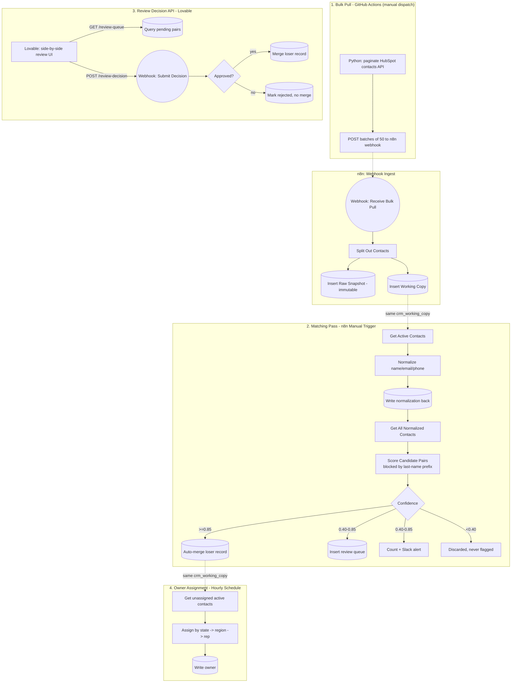

# Architecture

Four independent pieces, three different execution environments (GitHub
Actions, n8n, Lovable), sharing one Postgres database as the single source
of truth. See [README.md](README.md) for setup and troubleshooting.

## Why four separate triggers instead of one workflow

Each piece runs on a genuinely different clock, and coupling them would
create exactly the kind of hidden dependency this project is otherwise
careful to avoid:

- **Bulk pull (manual dispatch)** is a heavy, infrequent operation — the
  kind of thing you run once to seed the system, or occasionally to
  resync. It's the only piece that talks to the CRM's real API, and it's
  the only piece that runs outside n8n entirely (GitHub Actions). n8n can
  paginate fine — this isn't a capability gap. It's about isolating a
  slow, rate-limited operation from the fast day-to-day flows: at
  33K-65K-record scale, a full pull is hundreds of throttled API calls
  that can run for minutes, and tying up an n8n execution slot for that
  long, on every resync, competes with the matching pass, review-decision
  webhook, and owner assignment for the same execution capacity (and on
  n8n Cloud, counts against execution-based billing). GitHub Actions
  runners are built for exactly this shape of job — long, infrequent,
  isolated — so the heavy pull lives there, and n8n stays free to handle
  the real-time pieces without contention.
- **The matching pass (manual trigger)** is deliberately not automatic yet
  in this build — running it on a schedule before the confidence
  thresholds have been validated against real review decisions would mean
  auto-merging on unproven logic. A real deployment would move this to a
  schedule once trusted.
- **The review-decision API (webhook)** has to be real-time — a person
  clicking Approve in Lovable can't wait for a batch job.
- **Owner assignment (hourly schedule)** runs independently of the
  matching pass on purpose. n8n only allows one Manual Trigger per
  workflow, so it couldn't share the matching pass's trigger even if that
  were desirable — but it isn't anyway: assignment only depends on which
  records are currently `status='active'` and unowned, not on whether a
  merge happened in the last hour specifically.

## Shared state, not shared logic

`crm_working_copy` is the one table every piece reads or writes. The bulk
pull writes new rows into it, the matching pass reads and updates it, the
review-decision API updates it on approval, and owner assignment reads and
updates it. None of these pieces call each other directly — they don't
need to, because they all agree on what the current state of that table
means. That's what makes it safe for them to run on independent triggers
without stepping on each other.

## The raw snapshot is never in this loop

`crm_raw_snapshot` only appears once, at ingest. Nothing downstream reads
from it, and nothing ever writes to it again after the initial insert.
It exists purely as a rollback reference — proof of what the data looked
like before any matching, merging, or review decision touched it.
